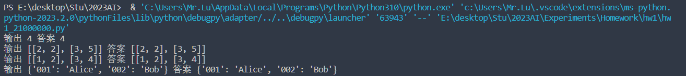

# 人工智能实验报告 第1周

姓名:卢科州  学号:21307335

### 一.实验题目

使用python实现四个函数，分别实现二分查找，矩阵加法，矩阵乘法和字典反向的功能

### 二.实验内容

###### 1.算法原理 

二分查找通过取一个上下限不断对比中间值的方法避免了列表内所有元素都要比较的麻烦，因此大幅度减少了时间复杂度。矩阵的加法乘法采用线性代数的基本定义和基本方法。反转字典我们是通过迭代遍历字典加入到新的字典来实现新字典是旧字典的反转。

### 三.实验结果及分析

###### 1.实验结果展示示例（可截图可表可文字，尽量可视化)



###### 2.评测指标展示及分析（机器学习实验必须有此项，其它可分析运行时间等）

二分查找：查找时间复杂度$O(logn)$，空间复杂度$O(1)$

矩阵加法，以m*n矩阵为例，时间复杂度$O(mn)$

矩阵乘法，以m\*n矩阵和n\*k矩阵形式为例，时间复杂度$O(mnk)$

字典反向，时间复杂度$O(n)$,空间复杂度$O(n)$

### 四.参考资料(可选)

### 实验代码

```
def BinarySearch(nums, target):
    size=len(nums)
    low=0
    high=size-1
    while nums[(int)((low+high)/2)]!=target:
        if nums[(int)((low+high)/2)]<target:
            low=(int)((low+high)/2)+1
        else: high=(int)((low+high)/2)-1 
    return (int)((low+high)/2)

def MatrixAdd(A, B):
    if len(A)!=len(B)|len(A[0])!=len(B[0]): 
        return []
    matrix=[[0 for i in range(len(A[0]))] for j in range(len(A))]
    for i in range(len(A)):
        for j in range(len(A[0])):
            matrix[i][j]=A[i][j]+B[i][j]
    return matrix

def MatrixMul(A, B):
    if len(A[0])!=len(B): 
        return []
    matrix=[[0 for i in range(len(B[0]))] for j in range(len(A))]
    for i in range(len(A)):
        for j in range(len(B[0])):
            for k in range(len(A[0])):
                matrix[i][j]+=A[i][k]*B[k][j]
    return matrix

def ReverseKeyValue(dict1):
    newDict={}
    for name, code in dict1.items():
        newDict[code]=name
    return newDict
```
