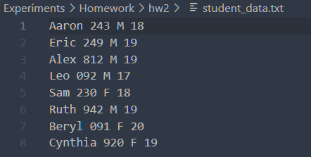
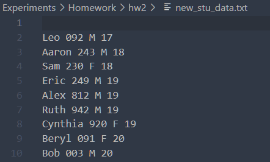

# 人工智能实验报告 第2周

姓名:卢科州  学号:21307335

### 一.实验题目

使用python实现一个StuData类，实现对于学生信息的文件读取初始化，增添学生信息，排序和将学生信息输出到文件的功能

### 二.实验内容

###### 1.算法原理

是类的实践性实验，因此算法上没有复杂性；

需要注意的是通过引入os.chdir()确定工作目录后才可以实现对于目标文件的读取

此外在调用函数的时候倘若需要不同的sort的key，则需要调用一个含有对象参数的函数返回该对象中需要的key值

### 三.实验结果及分析

###### 1.实验结果展示示例（可截图可表可文字，尽量可视化)





可以看到输入由图一经过添加学生信息和按年龄排序之后实现图二的输出，实现了学生数据的管理

###### 2.评测指标展示及分析（机器学习实验必须有此项，其它可分析运行时间等）

对于文件的读取输出都是顺序的，所以时间复杂度都为$O(n)$

此外对于sort函数的时间复杂度，同官方文档时间复杂度

### 四.参考资料(可选)

### 实验代码

```
import os
class Stu:
    def __init__(self,str):
        str.strip();
        data=str.split(' ')
        self.name=data[0]
        self.stu_num=data[1]
        self.gender=data[2]
        self.age=int(data[3])
def by_name(stu):
    return stu.name;
def by_schoolnum(stu):
    return stu.stu_num;
def by_gender(stu):
    return stu.gender;
def by_age(stu):
    return stu.age;
class StuData(Stu):
    def __init__(self,textname):
        self.data = []
        with open(textname,'r') as f:
            for line in f:
                self.data.append(Stu(line))
    def SortData(self,str):
        if str=="name":
            self.data.sort(key=by_name)
        elif str=="stu_num":
            self.data.sort(key=by_schoolnum)
        elif str=="gender":  
            self.data.sort(key=by_gender)
        elif str=="age":      
            self.data.sort(key=by_age)
    def AddData(self,name, stu_num, gender, age):
        self.data.append(Stu(name+" "+stu_num+" "+gender+" "+str(age)))
    def ExportFile(self,newfilename):
        with open(newfilename, 'a+') as f:
            for stu in self.data:
                print(stu.name,stu.stu_num,stu.gender,stu.age,file=f)

```
