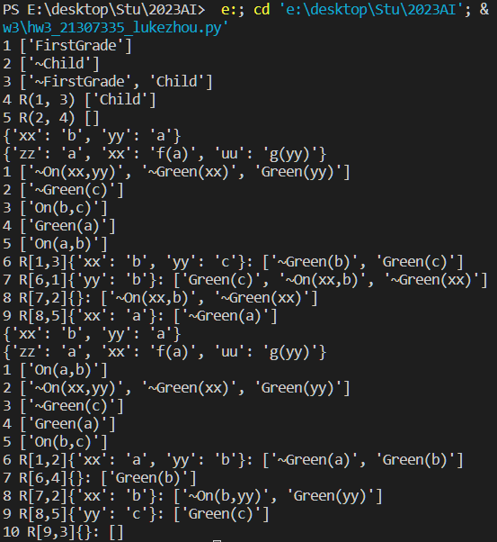

# 人工智能实验报告 第3周

姓名:卢科州  学号:21307335

### 一.实验题目

使用python实现逻辑归纳和最一般归一算法,并且最终结合起来实现一阶逻辑的逻辑归结

### 二.实验内容

###### 1.算法原理

归结算法

◼将α取否定，加入到KB当中

◼将更新的KB转换为clausal form得到S

◼反复调用单步归结如果得到空子句，即S|-()，说明KB ∧¬α 不可满足，算法终止，可得KB |= α如果一直归结直到不产生新的子句，在这个过程中没有得到空子句，则KB |= α不成立

最一般归一算法:
◼k=0;σo={};So={f,g)
◼如果Sk中的公式等价，返回σk作为最一般合一的结果
  ◼否则找出S中的不匹配项D=(e1,e2)
◼如果el=V是变量，e2=t是一个不包含变量V的项，将“V=t”添加到赋
 值集合σK+1=σkU{V=t};并将Sk中的其它V变量也赋值为t，得到Sk+1;
 k=k+1，转到第二步
   ◼否则合一失败

### 三.实验结果及分析

###### 1.实验结果展示示例（可截图可表可文字，尽量可视化)



可以看到输入由

###### 2.评测指标展示及分析（机器学习实验必须有此项，其它可分析运行时间等）

由于逻辑归结的过程中需要对每一个列表（子句集）的项（子句）进行依次对比选择，因此时间复杂度都在 $ O(n^2) $

代码实现上需要考虑输出内容的特化，尤其是对于序号的处理决定输出的格式

### 四.参考资料(可选)

### 实验代码

```
import copy


def retake(num, r, fullclause, selclause):
    for temp in selclause:
        for i in temp:
            for rever in selclause:
                for j in rever:
                    if i == '~'+j or j == '~'+i:
                        book1 = copy.deepcopy(temp)
                        temp2 = copy.deepcopy(rever)
                        book1.remove(i)
                        temp2.remove(j)
                        temp2.extend(book1)
                        fullclause.append(temp2)
                        selclause.append(temp2)
                        selclause.remove(temp)
                        selclause.remove(rever)
                        num.append(num[-1]+1)
                        r.append((fullclause.index(temp)+1,
                                 fullclause.index(rever)+1))
                        return True
    return False


def ResolutionProp(KB):
    count = 1
    num = []
    r = []
    fullclause = []
    selclause = []
    origin = list(KB)
    for temp in origin:
        fullclause.append(list(temp))
        selclause.append(list(temp))
        num.append(count)
        count += 1
        r.append((0, 0))
    flag = True
    while flag:
        flag = retake(num, r, fullclause, selclause)
    res = []
    for i in range(len(num)):
        if r[i][0] == 0:
            res.append(str(num[i])+' '+str(fullclause[i]))
        else:
            res.append(str(num[i])+' R'+str(r[i])+' '+str(fullclause[i]))
    return res


def MGU(f11, f22):
    f1 = copy.deepcopy(f11)
    f2 = copy.deepcopy(f22)
    ret = {}
    constance = ['xx', 'yy', 'zz', 'uu', 'vv', 'ww']
    book1 = f1.index('(')
    book2 = f2.index('(')
    if f1[0:book1] != f2[0:book2]:
        return False
    else:
        f1 = f1[book1+1:-1]
        f2 = f2[book2+1:-1]
    f1 = f1.split(',')
    f2 = f2.split(',')

    if len(f1) != len(f2):
        return []
    for i in range(len(f1)):
        if f1[i] == f2[i]:
            continue
        while f1[i][0] == f2[i][0]:
            book1 = f1[i].index('(')
            book2 = f2[i].index('(')
            if f1[0:book1] == f2[0:book2]:
                f1[i] = f1[i][book1+1:-1]
                f2[i] = f2[i][book2+1:-1]
        # Unit
        if f1[i] != f2[i]:
            if f1[i] in constance and f2[i] not in constance:
                ret[f1[i]] = f2[i]
                adds_begin = f1[i]
                adds_end = f2[i]
                for j in range(len(f1)):
                    f1[j] = f1[j].replace(adds_begin, adds_end)
            elif f2[i] in constance and f1[i] not in constance:
                ret[f2[i]] = f1[i]
                adds_begin = f2[i]
                adds_end = f1[i]
                for j in range(len(f2)):
                    f2[j] = f2[j].replace(adds_begin, adds_end)
            elif f1[i] in constance and f2[i] in constance:
                ret[f1[i]] = f2[i]
                adds_begin = f1[i]
                adds_end = f2[i]
                for j in range(len(f1)):
                    f1[j] = f1[j].replace(adds_begin, adds_end)
            elif f2[i] not in constance and f1[i] not in constance:
                return False
            elif f1[i] in constance and f2[i] in constance:
                ret[f1[i]] = f2[i]
                adds_begin = f1[i]
                adds_end = f2[i]
                for j in range(len(f1)):
                    f1[j] = f1[j].replace(adds_begin, adds_end)
    return ret


def adds(s, f):
    a = copy.deepcopy(f)
    for i in range(len(a)):
        for j in s:
            a[i] = a[i].replace(j, s[j])
    return a


def remove_ret(ret, res, a, b, len1):
    a1 = 0
    b1 = 0
    a2 = 0
    b2 = 0
    if a < len1+1 and b < len1+1:
        return
    if a > len1:
        spl1 = ret[a-1].split(' ')
        splen1 = spl1[1].split(',')
        spll_1 = splen1[1].split(']')
        a1 = int(splen1[0][2:])
        b1 = int(spll_1[0])
        remove_ret(ret, res, a1, b1, len1)
        res.append(ret[a-1])
    if b > len1:
        spl2 = ret[b-1].split(' ')
        spll2 = spl2[1].split(',')
        spll_2 = spll2[1].split(']')
        a2 = int(spll2[0][2:])
        b2 = int(spll_2[0])
        remove_ret(ret, res, a2, b2, len1)
        res.append(ret[b-1])


def ResolutionFOL(KB):
    kb = list(KB)
    len1 = len(kb)
    for i in range(len(kb)):
        kb[i] = list(kb[i])
    num = 1
    ret = []
    for tup in kb:
        ad = str(num)+" "+str(tup)
        num += 1
        ret.append(ad)

    # 这里100指的是推理过程中可能要保存的最大步数，可以根据需要调整
    for i in range(100):
        for j in range(len(kb[i])):
            if kb[i][j][0] != '~':
                prevar = '~'+kb[i][j]
            else:
                prevar = kb[i][j].replace('~', '')

            for x in range(len1):
                if(i == x):
                    continue
                for y in range(len(kb[x])):
                    # s为合一变换公式集合

                    # 计算出prevar后，再次遍历kb,看其中能否找到prevar或者可以与prevar合一的项：
                    s = MGU(prevar, kb[x][y])
                    if s == False:
                        continue
                    new1 = adds(s, kb[i])
                    new2 = adds(s, kb[x])

                    # str1记录s替换prevar后的项。以便移除~(n)和(n)后归结
                    str0 = adds(s, [prevar, ''])
                    str1 = str0[0]
                    # str1=~On(a,b)
                    if str1[0] == '~':
                        str2 = str1.replace('~', '')
                    else:
                        str2 = '~'+str1
                    new1.remove(str2)
                    new2.remove(str1)
                    new = new1[:]
                    for nu in new2:
                        new.append(nu)
                    # 利用flag,将new不重复的添加到kb中，
                    flag = 1
                    for t in kb:
                        if new == t:
                            flag = 0
                    if flag == 1:
                        kb.append(new)
                        ad = str(num)+" R["+str(i+1)+',' + \
                            str(x+1)+"]"+str(s)+": "+str(new)
                        ret.append(ad)
                        num += 1
                    if len(new) == 0:
                        res = []
                        for sss in range(len1):
                            res.append(ret[sss])
                        length = len(ret)
                        spl = ret[length-1].split(' ')
                        spll = spl[1].split(',')
                        a = int(spll[0][2:])
                        spll_n = spll[1].split(']')
                        b = int(spll_n[0])
                        remove_ret(ret, res, a, b, len1)
                        res.append(ret[length-1])

                        for o in range(len(res)):
                            o1 = int(res[o].split(' ')[0])
                            for oo in range(len(res)):
                                if oo <= o:
                                    continue
                                oo1 = int(res[oo].split(' ')[0])
                                if o1 > oo1:
                                    s1 = res[o]
                                    res[o] = res[oo]
                                    res[oo] = s1
                        newlen = len1+1
                        for temp in range(len(res)):
                            if temp < len1:
                                continue
                            knn = res[temp].split(' ')
                            k1 = knn[0]
                            for tem in range(len(res)):
                                res[tem] = res[tem].replace(k1, str(newlen))
                            newlen += 1
                        return res

    return ret

    # 测试函数
if __name__ == '__main__':
    # 测试程序
    KB1 = {('FirstGrade',), ('~FirstGrade', 'Child'), ('~Child',)}
    result1 = ResolutionProp(KB1)
    for r in result1:
        print(r)

    print(MGU('P(xx,a)', 'P(b,yy)'))
    print(MGU('P(a,xx,f(g(yy)))', 'P(zz,f(zz),f(uu))'))
    KB2 = {('On(a,b)',), ('On(b,c)',), ('Green(a)',), ('~Green(c)',),
           ('~On(xx,yy)', '~Green(xx)', 'Green(yy)')}
    result2 = ResolutionFOL(KB2)
    for r in result2:
        print(r)
```
