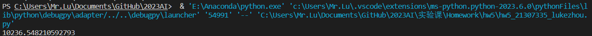
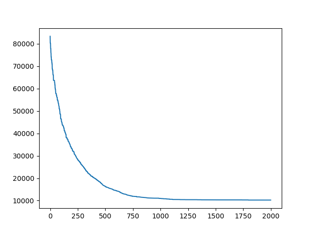
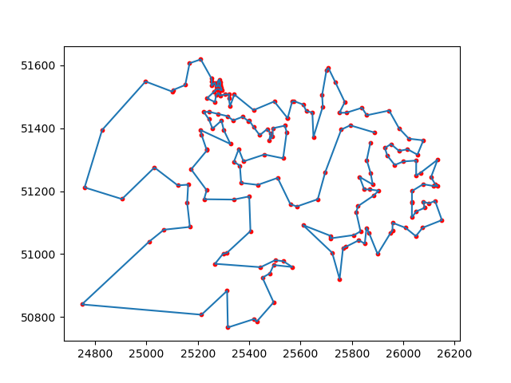

# 人工智能实验报告 第7周

姓名:卢科州  学号:21307335

### 一.实验题目

使用python实现遗传算法解决TSP问题

### 二.实验内容

###### 1.算法原理

遗传算法的一般步骤：

1. 随机产生种群。
2. 根据策略判断个体的适应度，是否符合优化准则，若符合，输出最佳个体及其最优解，结束。否则，进行下一步。
3. 依据适应度选择父母，适应度高的个体被选中的概率高，适应度低的个体被淘汰。
4. 用父母的染色体按照一定的方法进行交叉，生成子代。
5. 对子代染色体进行变异。

### 三.实验结果及分析

###### 1.实验结果展示示例（可截图可表可文字，尽量可视化)



对于数据集qa194，我们可以看到在1500代左右可以完成收敛，耗时大约15分钟，取得一个比较接近最小值的效果





###### 2.评测指标展示及分析（机器学习实验必须有此项，其它可分析运行时间等）

代际进步随着种群大小和子代数量的加大而变得明显而不容易受限于局部最优解

同时我们通过强制引入一个判定条件来向稳定的集合中去除重复的数据，并加入新的数据作为外来种群降低局部最优可能

### 四.参考资料(可选)

* [^1^](https://ieeexplore.ieee.org/document/4663334/) A Novel Genetic Algorithm and Its Application in TSP，这篇论文提出了一种新的遗传算法，它通过合并两种启发式方法来创建交叉和变异操作，以提高遗传算法的局部搜索能力，然后引入外部最优个体集合来增加种群的多样性。理论分析和仿真结果表明，它可以得到高质量的解决方案，并且消耗较少的运行时间。
* [^2^](https://leimao.github.io/blog/Genetic-Algorithm-For-Travelling-Salesman-Problem/) Genetic Algorithm for Travelling Salesman Problem - Lei Mao，这篇博客介绍了用Python实现遗传算法求解TSP的过程和代码，还给出了一些参数的调整方法和可视化的结果。它还提到了一些可以改进遗传算法性能的技巧，比如使用精英策略、使用不同的交叉和变异操作、使用不同的选择方法等。
* [^3^](https://aip.scitation.org/doi/pdf/10.1063/1.5039131) Solving TSP problem with improved genetic algorithm，这篇论文提出了一种改进的遗传算法，它通过引入一个新的适应度函数来考虑路径长度和路径平滑度，以避免路径交叉和突变。它还通过引入一个新的变异操作来增加种群的多样性，并且使用一个动态的变异概率来控制变异程度。仿真结果表明，它可以得到更好的解决方案，并且收敛速度更快。
* [^4^](https://user.ceng.metu.edu.tr/~ucoluk/research/publications/tspnew.pdf) Genetic Algorithm Solution of the TSP Avoiding Special Crossover and Mutation，这篇论文提出了一种避免使用特殊交叉和变异操作的遗传算法求解TSP的方法，它通过使用一个简单而有效的编码方式来保证每个个体都是一个有效的路径，然后使用标准的交叉和变异操作来产生新的个体。理论分析和实验结果表明，它可以得到与特殊操作相当甚至更好的解决方案，并且运行时间更短。

### 实验代码

```

"""
第5次作业, 用遗传算法解决TSP问题
本次作业可使用`numpy`库和`matplotlib`库以及python标准库
请不要修改类名和方法名
"""
import numpy as np
import matplotlib.pyplot as plt
import pandas as pd
import copy as cp
import random as rd
import datetime
CHANCE_HOLD = 0.4
NUMCHILD = 100
RETREAT = 2000
GENE_TIME = 3400
BORNNUM = 2*NUMCHILD
HOLDS = 80
TIME_HOLD = 10


def check(p):
    for i in range(1, 39):
        if i not in p:
            return False
    return True


class GeneticAlgTSP:
    def __init__(self, tsp_filename):
        df = pd.read_csv('实验课\\Homework\\hw5\\'+tsp_filename,
                         sep=" ", skiprows=7, header=None)#skiprows必须要依据tsp文件非数据最后一行行号修改！！！！
        city = np.array(df[0][0:len(df)-1])  # 最后一行为EOF，不读入
        self.city_name = city.tolist()
        # print(city_name)
        city_x = np.array(df[1][0:len(df)-1])
        city_y = np.array(df[2][0:len(df)-1])
        self.city_location = list(zip(city_x, city_y))
        self.length = len(df)-1
        stand = list(range(1, self.length+1))
        self.population = []
        for i in range(NUMCHILD):
            temp = cp.deepcopy(stand)
            rd.shuffle(temp)
            self.population.append(temp)  # 初始化种群, 会随着算法迭代而改变
        self.num = []
        self.routing = []
    # 随机选择父代

    def choose2(self,  parent):
        begin = rd.randint(0, len(parent)-1)
        end = rd.randint(begin, len(parent)-1)
        return (cp.deepcopy(parent[begin]), cp.deepcopy(parent[end]))
    # 染色体交换

    def exchange(self, p1, p2):
        begin = rd.randint(0, len(p1)-1)
        end = rd.randint(begin, len(p1)-1)
        for i in range(begin, end+1):
            temp = p1[i]
            p1[i] = p2[i]
            p2[i] = temp
        dict = {}
        dicts = {}
        for i in range(begin, end+1):
            flag = 0
            if p2[i] in dict.keys() and p1[i] in dicts.keys():
                dicts[dict[p2[i]]] = dicts[p1[i]]
                dict[dicts[p1[i]]] = dict[p2[i]]
                del dict[p2[i]]
                del dicts[p1[i]]
            elif p2[i] in dict.keys():
                dict[p1[i]] = dict[p2[i]]
                dicts[dict[p2[i]]] = p1[i]
                del dict[p2[i]]
            elif p1[i] in dicts.keys():
                dicts[p2[i]] = dicts[p1[i]]
                dict[dicts[p1[i]]] = p2[i]
                del dicts[p1[i]]
            else:
                dict[p1[i]] = p2[i]
                dicts[p2[i]] = p1[i]

        for i in range(0, begin):
            if p1[i] in dict:
                p1[i] = dict[p1[i]]
            if p2[i] in dicts:
                p2[i] = dicts[p2[i]]
        for i in range(end+1, self.length):
            if p1[i] in dict:
                p1[i] = dict[p1[i]]
            if p2[i] in dicts:
                p2[i] = dicts[p2[i]]
        return (p1, p2)
# 变异

    def vary(self, c1, c2):
        hold = rd.random()
        if hold <= CHANCE_HOLD:
            return (c1, c2)
        (begin, end) = (rd.randint(0, self.length), rd.randint(0, self.length))
        while begin >= end:
            (begin, end) = (rd.randint(0, self.length), rd.randint(0, self.length))
        c1[begin:end+1] = list(reversed(c1[begin:end+1]))
        c2[begin:end+1] = list(reversed(c2[begin:end+1]))
        return (c1, c2)
# 选出最优父代

    def pick(self, parent):
        point = parent[0]
        min = self.compute(parent[0])
        for i in parent:
            temp = self.compute(i)
            # print(temp)
            if temp < min:
                min = temp
                point = i
        return cp.deepcopy(point)
# 计算路径长度

    def compute(self, route):
        cost = 0
        for i in range(self.length):
            cost += ((self.city_location[route[i]-1][0]-self.city_location[route[i-1]-1][0])**2+(
                self.city_location[route[i]-1][1]-self.city_location[route[i-1]-1][1])**2)**0.5
        return cost
# 选择下一批父代

    def choose(self, parent, child):
        num = []
        new = []
        parent.extend(child)
        for i in range(len(parent)):
            num.append(self.compute(parent[i]))
        temp = np.argsort(num)
        best = parent[num.index(np.min(num))]
        for i in range(NUMCHILD):
            new.append(parent[temp[i]])
        return (new, best)
# 迭代

    def iterate(self, num_iterations):
        parent = self.population
        for nums in range(num_iterations):
            # print(nums)
            child = []
     if parent[0] == parent[-1]:
                del parent[-1]
                del parent[0]
                temp = list(range(1, self.length+1))
                rd.shuffle(temp)
                parent.append(temp)
                rd.shuffle(temp)
                parent.append(temp)
            # 一旦有稳定趋向就把相同项保留一个并且引入新子代
            for i in range(BORNNUM):
                (p1, p2) = self.choose2(parent)  # 随机选择父代
                (c1, c2) = self.exchange(p1, p2)  # 染色体交叉
                (c1, c2) = self.vary(c1, c2)  # 染色体变异
                child.append(c1)
                child.append(c2)
            #starttime = datetime.datetime.now()
            (parent, best) = self.choose(parent, child)  # 父代子代共同挑选下一轮父代
            #endtime = datetime.datetime.now()
            # 显示当前最优状态：
            self.num.append(nums)
            self.routing.append(self.compute(best))
            plt.plot(self.num, self.routing)
            plt.show(block=False)
            plt.pause(0.1)
            plt.cla()
            # print(endtime-starttime)
        return self.pick(parent)  # 选出最好的


if __name__ == "__main__":
    tsp = GeneticAlgTSP("qa194.tsp")  # 读取Djibouti城市坐标数据
    T = GENE_TIME
    tour = tsp.iterate(T)  # 对算法迭代T次
    print(tsp.compute(tour))
    plt.figure(1)
    plt.plot(tsp.num, tsp.routing)
    plt.show(block=False)
    xpoint = []
    ypoint = []
    for i in range(len(tour)):
        xpoint.append(tsp.city_location[tour[i]-1][0])
        ypoint.append(tsp.city_location[tour[i]-1][1])
    xpoints = np.array(xpoint)
    ypoints = np.array(ypoint)
    plt.figure(2)
    plt.plot(xpoints, ypoints)
    plt.scatter(xpoints, ypoints, color='red', s=10)
    plt.show(block=False)
    plt.pause(20000)
    plt.cla()
    print(tsp.compute(tour))
```
